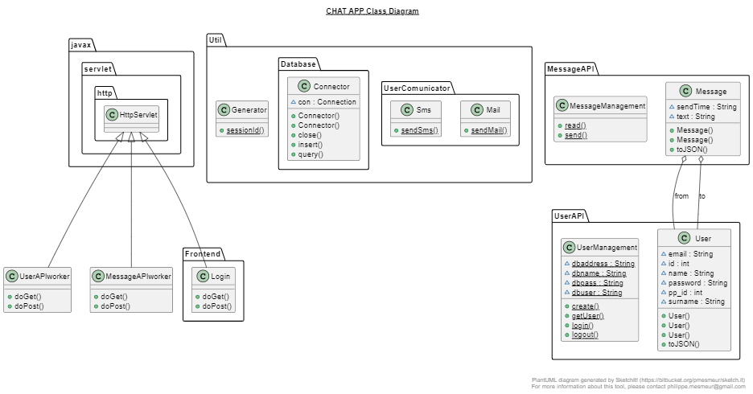

# Online Chat APP
## using java servlets

---
### Class diagram


---
### Deployment procedure
create under tomcat application folder the following structure:
```
chat-app
    WEB-INF
        classes
```
under the ``WEB-INF`` directory paste the `` web.xml`` file<br>
under the ``classes`` directory paste the following classes and packages:
- MessageAPI
- UserAPI
- Util
- Frontend
- UserAPI.java
- MessageAPI.java
- lib

---

On MySQL add the following database code, pay attention that MySQL need to be on the same server of Tomcat
```SQL
create schema messages;
use messages;
create table user (id int primary key auto_increment, name varchar(100), surname varchar(100), 
                   email varchar(100), pp_id int, password varchar(100), settings JSON);
create table session (id int primary key, last_login timestamp, user_id int, 
                      FOREIGN KEY (user_id) REFERENCES user(id));
create table message (id int primary key auto_increment, text text, s_time datetime, r_time datetime, 
                      send_user int, dest_user int, FOREIGN KEY (send_user) REFERENCES user(id), 
                      FOREIGN KEY (dest_user) REFERENCES user(id));
```